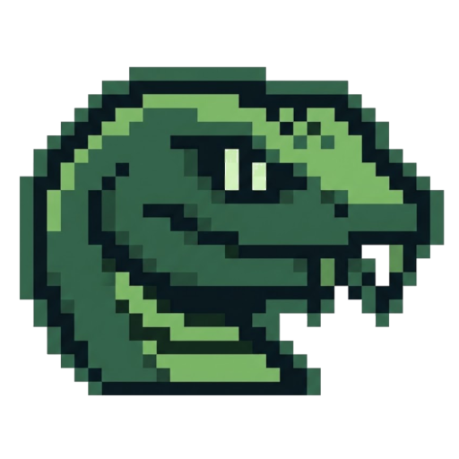
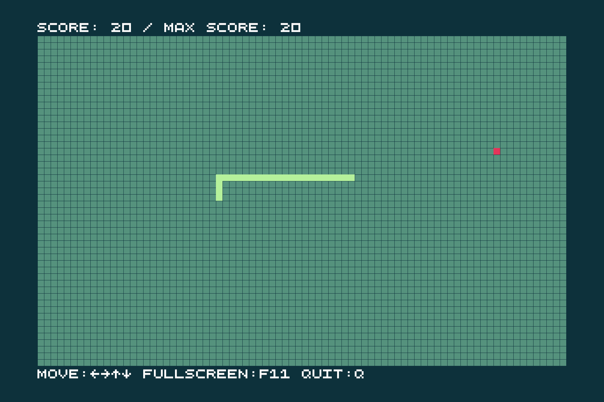
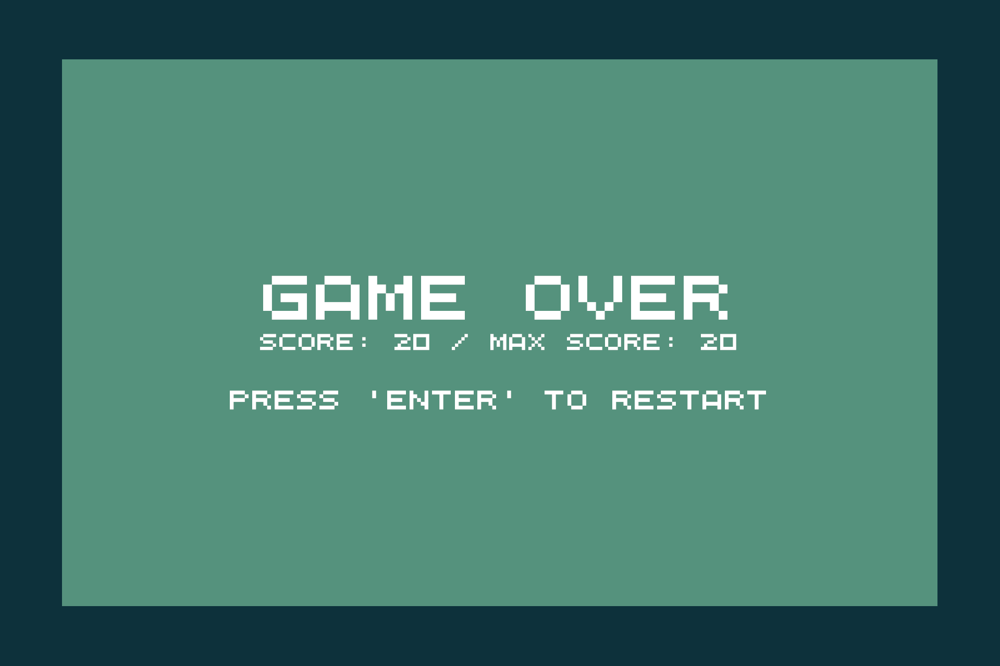

# Serpent Path

<p align="center"></p>

<https://github.com/user-attachments/assets/0bbc4c7a-15a3-4278-878e-90df2d39bf08>




**The Serpent Path** is a retro arcade Snake game built from scratch in C/C++ with a classic Nintendo Game Boy aesthetic. Navigate the serpent, eat apples to grow longer, and chase your high score across a wrapping grid while avoiding self-collision!

## Releases

Pre-built binaries can be downloaded from the [GitHub Releases](https://github.com/AnzenKodo/serpent-path/releases) page.

## Dependences

- Required
    - Operating System: Linux
    - C Compiler: clang, gcc
    - Libraries:
        - C Math Library (`libm` / `-lm`)
        - POSIX Threads (`libpthread` / `-lpthread`)
        - Dynamic Linking Loader (`libdl` / `-ldl`)
        - XCB (X C Binding - Windowing & Input):
            - XCB Core (`libxcb`)
            - XCB Image (`libxcb-image`)
            - XCB Sync (`libxcb-sync`)
            - XCB Keysyms (`libxcb-keysyms`)
            - XCB Cursor (`libxcb-cursor`)
        - Graphics:
            - OpenGL (`libGL`)
            - EGL (`libEGL`)

## Building

Compile the build tool:
```sh
clang++ build.cpp
```
Building and Running the project:
```sh
./a.out build-run release # For Linux
a.exe build-run release   # For Windows
```
For more build system options/help:
```sh
./a.out --help # For Linux
a.exe --help   # For Windows
```
